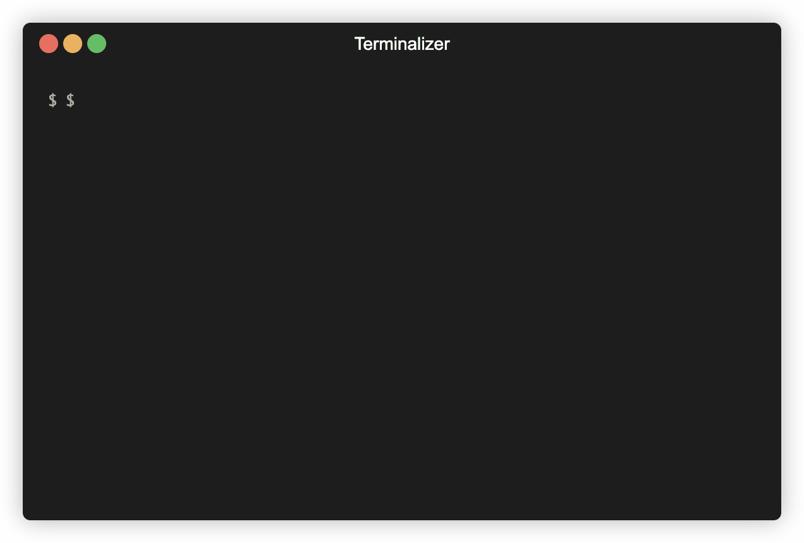

<p align="center">
  <a href="" rel="noopener">
  </a>
</p>

<h1 align="center">Drupal extension scaffold</h1>

<div align="center">

[](https://github.com/AlexSkrypnyk/drupal_extension_scaffold/issues)
[](https://github.com/AlexSkrypnyk/drupal_extension_scaffold/pulls)
[](https://github.com/AlexSkrypnyk/drupal_extension_scaffold/actions/workflows/test.yml)
[](https://circleci.com/gh/AlexSkrypnyk/drupal_extension_scaffold)
[](https://codecov.io/gh/AlexSkrypnyk/drupal_extension_scaffold)


</div>

---

<p align="center">Drupal extension template for development and testing in CI of your choice with mirroring to Drupal.org</p>

## Use case

Perform extension development in GitHub with testing in CI, and push code
committed only to the main branches (`1.x`, `2.x` etc.)
to [drupal.org](https://drupal.org).

## Features

- Turnkey CI configuration with artifacts and test results support.
  - PHP version matrix for [8.2](https://www.php.net/supported-versions.php), [8.3](https://www.php.net/supported-versions.php).
  - Drupal version matrix: `stable`, `next` and `last EOL` version.
  - CI providers:
      - [GitHub Actions](.github/workflows/test.yml)
      - [CircleCI](.circleci/config.yml)
- Tools:
  - Develop locally using PHP running on your host using
    identical [`.devtools`](.devtools) scripts as in CI.
    - Uses [drupal-composer/drupal-project](https://github.com/drupal-composer/drupal-project)
  to create drupal site structure. Providing a custom fork of `drupal-project` is also supported.
    - Additional development dependenices provided in [`composer.dev.json`](composer.dev.json). These are merged during the codebase build.
    - The extension can installed as a module or a theme: modify `type` property set in the `info.yml` file.
    - Additional dependencies can be added for integration testing
    between extensions: add dependency into [`suggest`](composer.json#L25) section
    of `composer.json`.
    
  - Codings standards checking:
    - PHP code standards checking against `Drupal` and `DrupalPractice` standards.
    - PHP code static analysis
      with PHPStan (including [PHPStan Drupal](https://github.com/mglaman/phpstan-drupal)).
    - PHP deprecated code analysis
      with [Drupal Rector](https://github.com/palantirnet/drupal-rector).
    - Twig code analysis with [Twig CS Fixer](https://github.com/VincentLanglet/Twig-CS-Fixer).
      
  - Drupal's Simpletest testing support - runs tests in the same way as
    [drupal.org](https://drupal.org)'s Drupal CI
    bot (`core/scripts/run-tests.sh`).
    
  - Renovate configuration to keep your repository dependencies up-to-date.
- Deployment:
  - Mirroring of the repo to [drupal.org](https://drupal.org) (or any other git
    repo) on release.
  - Deploy to a destination branch different from the source branch.
  - Tags mirroring.
- This template is tested in the same way as a project using it.

<table>
  <tr>
    <th>GitHub Actions</th>
   <th>CircleCI</th>
  </tr>
  <tr>
    <td></td>
    <td></td>
  </tr>
</table>

## Setup

1. Create your extension's repository on GitHub.
2. Download this extension's code by pressing 'Clone or download' button in GitHub
   UI.
3. Copy the contents of the downloaded archive into your extension's repository.
4. Run the initial setup script: `./init.sh`.
   
7. Commit and push to your new GitHub repo.
8. Login to your CI and add your new GitHub repository. Your project build will
   start momentarily.
9. Configure deployment to [drupal.org](https://drupal.org) (see below).
<details>
  <summary>Configure deployment (click to expand)</summary>

The CI supports mirroring of main branches (`1.x`, `10.x-1.x` etc.) to
[drupal.org](https://drupal.org) mirror of the project (to keep both repos in
sync).

The deployment job runs when commits are pushed to main branches
(`1.x`, `2.x`, `10.x-1.x` etc.) or when release tags are created.

Example of deployment
repository:
- from GitHub Actions: https://github.com/AlexSkrypnyk/drupal_extension_scaffold_destination_github
- from CircleCI: https://github.com/AlexSkrypnyk/drupal_extension_scaffold_destination_circleci


1. Generate a new SSH key without pass phrase:

```bash
ssh-keygen -m PEM -t rsa -b 4096 -C "your_email@example.com"
```

2. Add public key to your [drupal.org](https://drupal.org) account:
   https://git.drupalcode.org/-/profile/keys
3. Add private key to your CI:

- CircleCI:
  - Go to your project -> **Settings** -> **SSH Permissions**
  - Put your private SSH key into the box. Leave **Hostname** empty.
  - Copy the fingerprint string from the CircleCI User Interface. Then,
    replace the `deploy_ssh_fingerprint` value in the `.circleci/config.yml`
    file with this copied fingerprint string.
  - Push the code to your repository.

4. In CI, use UI to add the following variables:

- `DEPLOY_USER_NAME` - the name of the user who will be committing to a
  remote repository (i.e., your name on drupal.org).
- `DEPLOY_USER_EMAIL` - the email address of the user who will be committing
  to a remote repository (i.e., your email on drupal.org).
- `DEPLOY_REMOTE` - your extensions remote drupal.org repository (
  i.e. `git@git.drupal.org:project/myextension.git`).
- `DEPLOY_PROCEED` - set to `1` once CI is working, and you are ready to
  deploy.

To debug SSH connection used by Git, add `GIT_SSH_COMMAND` variable with value
`ssh -vvv`. This will output verbose information about the SSH connection and
key used.

</details>


